# Zabbix in Oracle Cloud (on an Oracle Database)

This is an example implementation of Zabbix monitoring software running in docker containers on an Oracle Database in Oracle Cloud.

Oracle Cloud Always Free Tier offering includes two free compute VM instances and two free Oracle database instances.
It was interesting to test how to deploy Zabbix to Oracle Always Free instance using Oracle DB as a backend.

## Getting Started

These instructions will get you a Zabbix Server running in Oracle Cloud less than in 15 minutes. It can be used for testing, development purposes, or
for monitoring a small fleet of servers. I monitor about 20 servers and don't see major issues. The most important thing you should keep in mind is that
**Always Free Oracle Database won't let you open more than 20 simultaneous connections**. Unfortunately out-of-the-box Zabbix opens by default more than 20 so I had to reduce its set of features in `zabbix_server.conf` to make it start. It still sends me an email with _ORA-00018: maximum number of sessions exceeded_ once in a while.

### Prerequisites

I will not go through the initial steps on how to create an Oracle Cloud instance. There are multiple sources of additional information on the web.
For example, I can recommend the set of [write-ups from Dimitri Gielis](https://dgielis.blogspot.com/2019/09/best-and-cheapest-oracle-apex-hosting.html).

I will also skip the installation of Docker and Docker Compose. I did it by the official Install Guides.
I personally ran everything under Ubuntu Server but it should work on every Linux that has Docker running and Docker Compose installed.

### Installing

#### Setting environment variables

1) Copy `.env.sample` to `.env`
2) Enter values for all the variables. The default values are used in screenshots below. 

 * ADMIN_PASSWORD
   * Administrator password for Oracle Autonomous Database, see below
 * CERTBOT_EMAIL
   * Email address used for registration and recovery contact of your ACME/Letsencrypt account
 * ORACLE_PASSWORD
   * Zabbix schema password
 * ORACLE_SERVICE_NAME
   * Oracle service name used in `tnsnames.ora` file
 * ORACLE_USER
   * Zabbix schema user name
 * ORACLE_WALLET_ZIP
   * Oracle client credentials zip file (Oracle Wallet) downloaded by administrator (zip file includes `tnsnames.ora`, `sqlnet.ora`, etc.)
 * PHP_TZ
   * Timezone to use in `php.ini`
 * ZABBIX_HOST_PATH
   * Docker volumes will be mounted under this directory (`/data/zabbix` by default)
     * `/data/zabbix/wallet` to update Oracle client credentials
     * `/data/zabbix/letsencrypt` to make `certbot` files available at the host
 * ZABBIX_SERVER_NAME
   * Zabbix web server name

#### Create database

[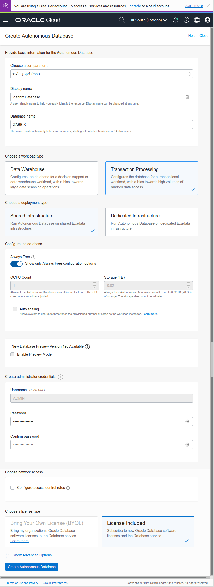](01_create_db.png "Create database")

#### Create workspace

[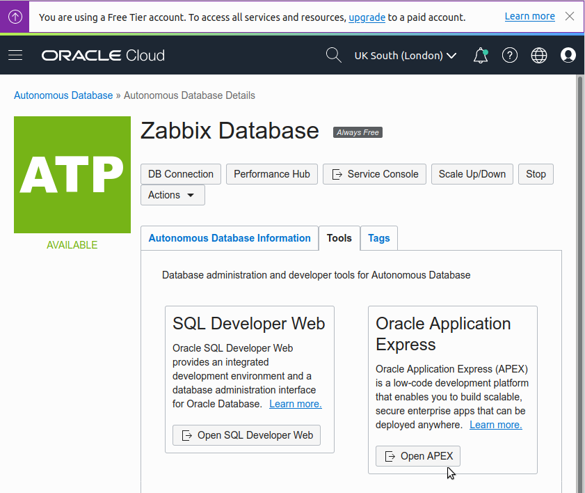](02_open_apex.png "Open Oracle Application Express (APEX)")
[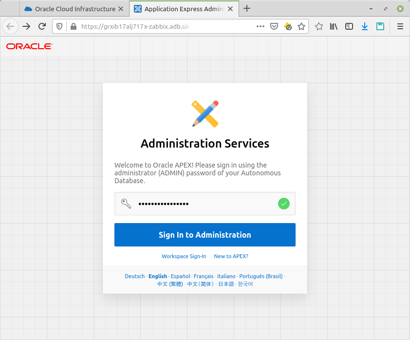](03_sign_in_to_admin.png "Sign In to Administration")
[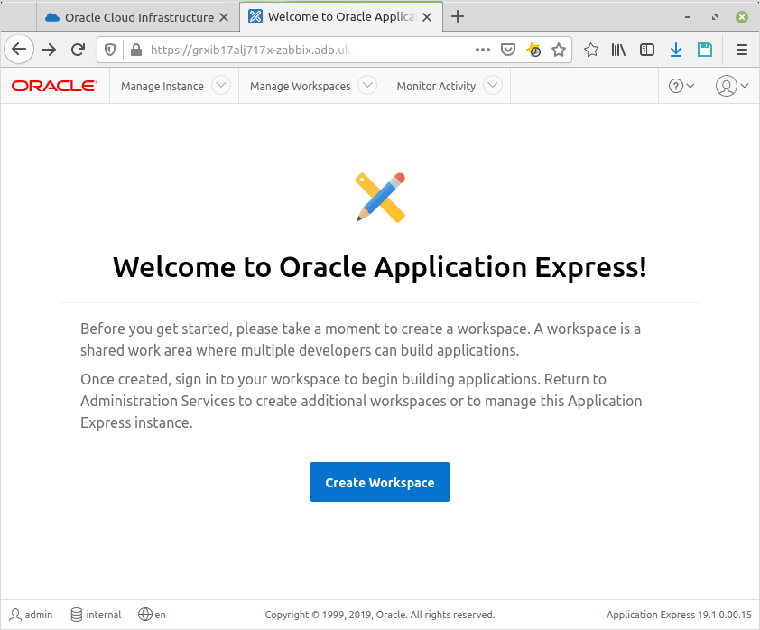](04_welcome_to_apex.png "Welcome to Oracle Application Express")
[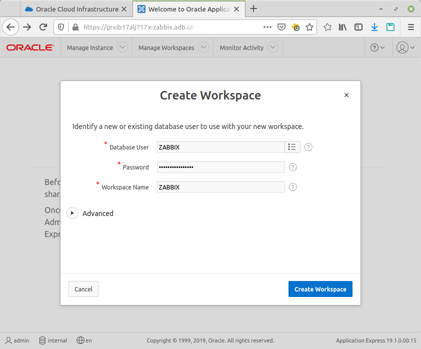](05_create_workspace.png "Create Workspace")

#### Download Wallet

Database connections to the Oracle Cloud autonomous database use a secure (`protocol=tcps`) connection. The wallet file will be used to configure Zabbix server to access the autonomous database.
You will be asked to create a password for this wallet. Zabbix server will not require this password to connect to database though.

[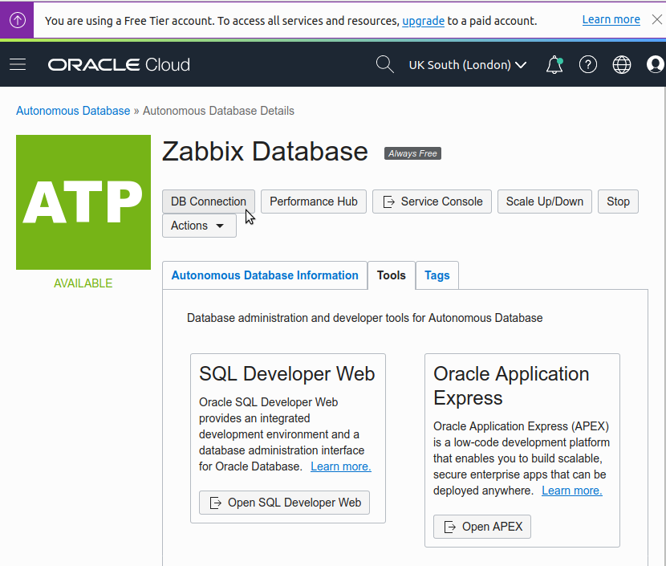](06_open_db_connection.png "Open DB Connection")
[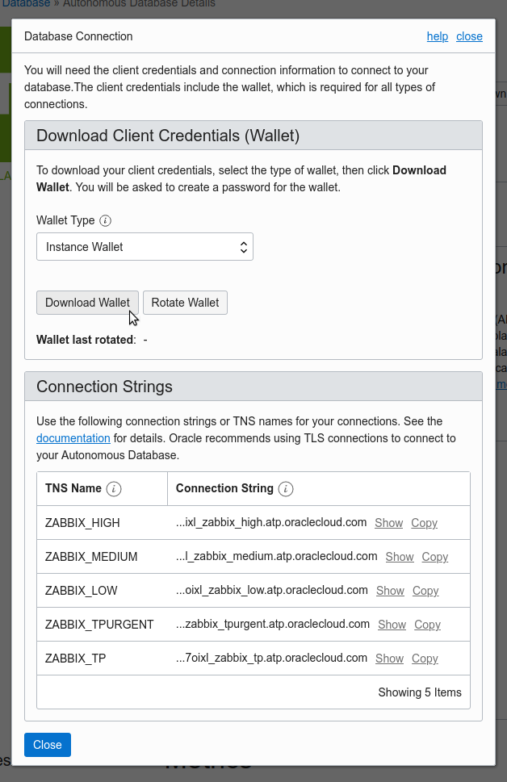](07_download_wallet.png "Download Wallet")

#### Setup Ingress Rules

Before building the containers, don't forget to update ingress rules for your Oracle Cloud instance's security list.
At least you want to pass incoming traffic:

 * from `0.0.0.0/0` to `80/tcp` to allow Letsencrypt certificates creation/renewal
 * from your public IP to `443/tcp` to access Zabbix console
 * from your Zabbix active clients to `10051/tcp`

#### Build

Just run `build.sh` and got get yourself a cuppa.

After the containers have started copy `Wallet_ZABBIX.zip` to `$ZABBIX_HOST_PATH/wallet/`—it will be unzipped automatically and the container will run healthy soon.

#### Configuration

In your browser, open `https://$ZABBIX_SERVER_NAME/`—mind the **https** at the beginning.

You should see the first screen of the frontend installation wizard.

[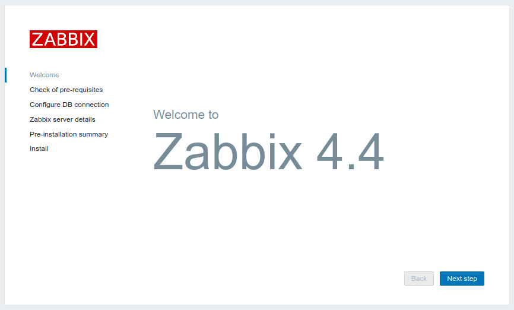](08_welcome_to_zabbix.png "Welcome to Zabbix")

Prerequisites should be fine, just ignore the PHP LDAP warning.

[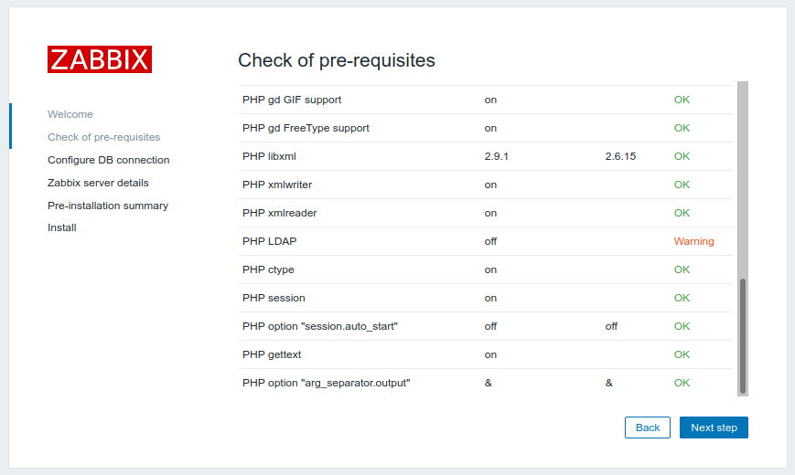](09_prerequisites.png "Check prerequisites")

At the next step, make sure you both empty the *Database host* field and type in the name of the service from your `tnsnames.ora` into the *Database name*.
Zabbix sources have been patched to allow service name lookups instead of default Zabbix' Oracle EZCONNECT method.
That is, if the *Database host* is not entered, the *Database name* is considered to be the service name instead.

[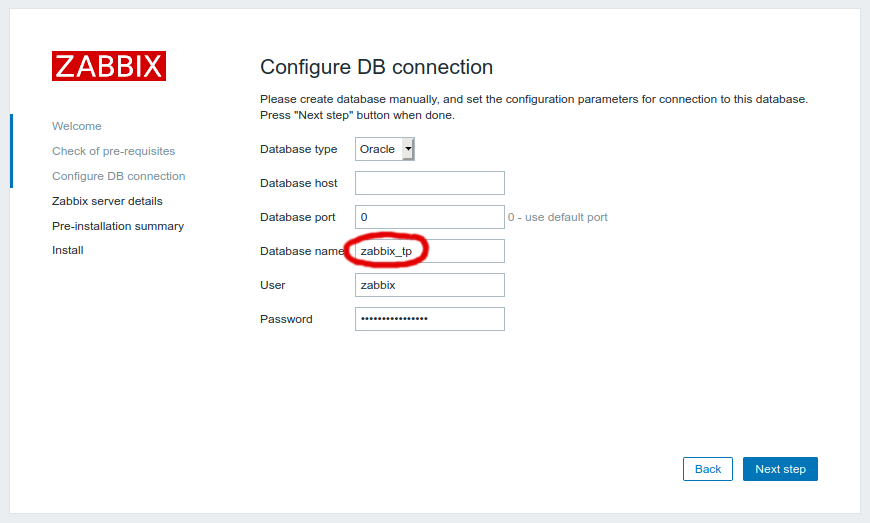](10_db_connection.png "Configure DB connection")

At the next screen, erase `localhost` and enter `zabbix-server` into the *Host* field.

[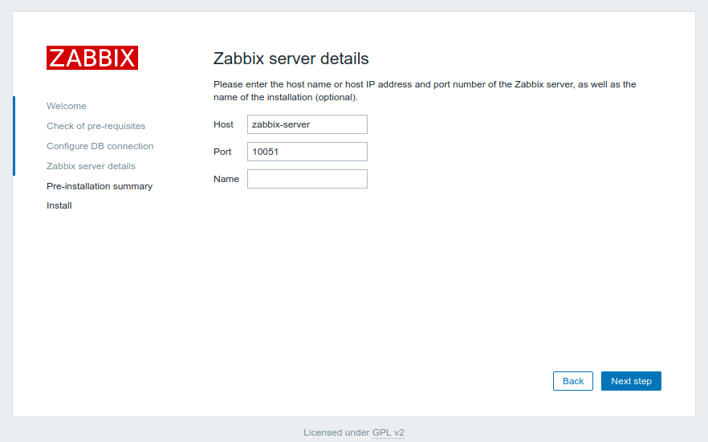](11_server_details.png "Zabbix server details")

That's it. The installation is finished, enjoy your new Zabbix server!

You can follow the Quickstart guide from Zabbix Documentaion now.
Enter the user name `Admin` with password `zabbix` to log in as a Zabbix superuser.  

#### Change Zabbix agent interface

To allow communication between `zabbix-agent` and `zabbix-server` containers, you should change the agent interface address in *Configuration → Hosts* menu.
Open your *Zabbix server* and update *Agent interfaces* as shown at the following screenshot (*Connect to*: **DNS**, *DNS name*: `zabbix-agent`).

[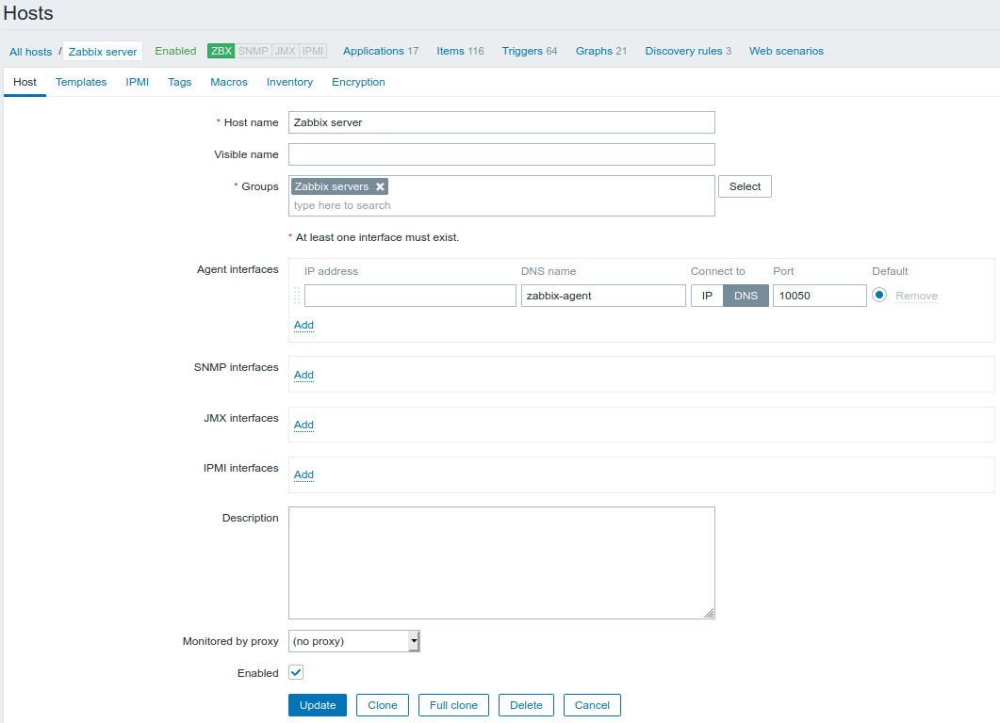](12_zabbix_server_agent.png "Change Zabbix agent interface")
